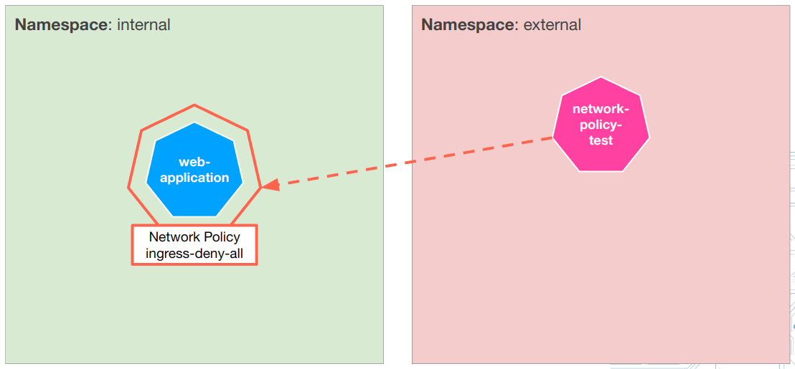
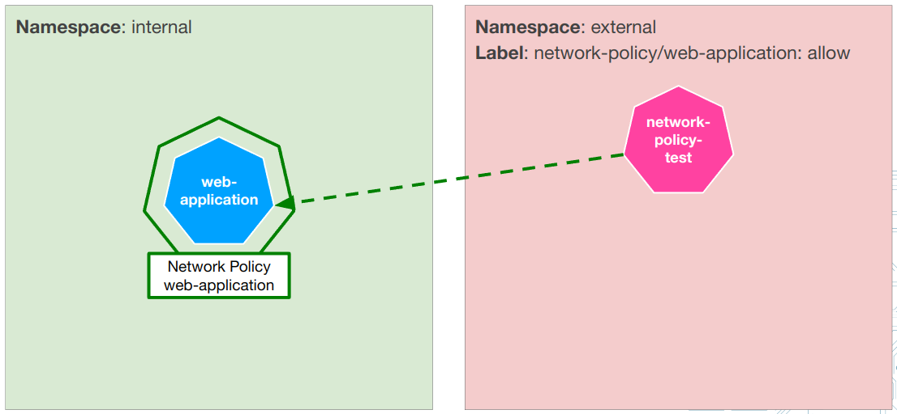
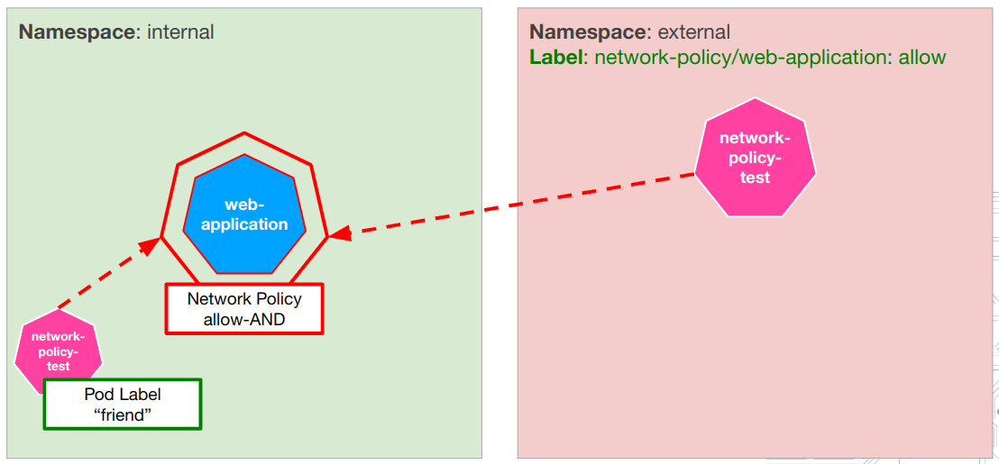
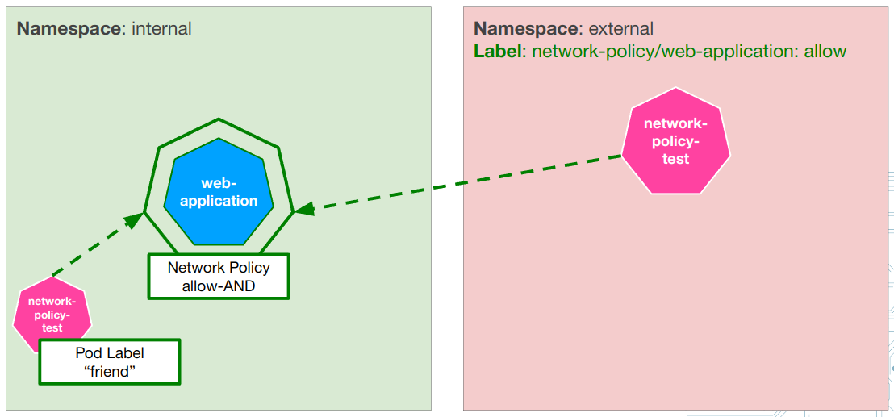

# Network Policies

## Preparation

* Before you begin with the actual exercise please make sure to follow these steps to work in your own environment:

  ```shell
  export YOURNAME=<YOURNAME> # <- please replace <YOURNAME> accordingly
  kubectl create ns ${YOURNAME}
  kubectl config set-context --current --namespace=${YOURNAME}
  ```

---

## Exercise 1

## Tasks

* Create a web-application
* Apply network policies to deny or allow traffic to the web-application

### Deploy the application

* Deploy the web-application

  ```shell
  kubectl apply -f web-application-deployment.yaml
  ```

### Deny traffic to it

* Deny all traffic to web-application labeled pods

  ```shell
  kubectl apply -f deny-all.yaml
  ```

* Start a busybox pod in a different namespace (use a different shell)

  ```shell
  kubectl create namespace ${YOURNAME}-external
  kubectl run -n ${YOURNAME}-external -it --image busybox network-policy-test -- sh
  
  # In the pod: Try to access your web-application
  wget -O- -q web-application.<YOURNAME> # <- replace with your name
  ```

* Notice the request time out

  ```text
  Connecting to web-application.<YOURNAME> (10.240.26.60:80)
  ```

* Exit the busybox pod with `exit`

### Recap

* Currently the deny-all network policy prohibits any incoming traffic: 



---

### Allow traffic to it

* Add the label `network-policy/web-application: allow` to your newly created external-namespace

  ```shell
  kubectl label namespace ${YOURNAME}-external network-policy/web-application=allow
  ```

* then deploy a network policy to your personal namespace to allow some external traffic by applying `allow-web-application.yaml`

  ```shell
  kubectl apply -f allow-web-application.yaml
  ```

* In your busybox test pod, see that it works again:

  ```shell
  kubectl -n ${YOURNAME}-external exec -it network-policy-test -- sh
  wget -q -O- web-application.<YOUR_NAME> # <- replace with YOUR NAME accordingly
  ```

* Exit the busybox pod with `exit`

### Recap

* The new (additional) network policy allows traffic originating from a namespace with a specific label
to enter the target pod. 




### Clean up network policies

  ```shell
  kubectl delete -f allow-web-application.yaml && \
  kubectl delete -f deny-all.yaml
  ```

---

## Exercise 2

## Tasks

* Create a web-application
* Apply network policies allow certain traffic to the web-application

### Deploy the application

* Deploy the first network policy

  ```shell
  kubectl apply -f allow-web-application-and.yaml
  ```

### Status

* Currently "AND"-network policy only allows traffic that satisfies both conditions at the same time: 
  * traffic must originate from a namespace with a specific label
  * originating pod must aso have a specific label



* Our network-policy-test pod does only satisfy 1 condition
* it comes from labeled namespace, but it has no pod label

* Start a busybox pod in your "-external" namespace (use a different shell)

  ```shell
  kubectl run -n ${YOURNAME}-external -it --image busybox network-policy-test -- sh
  
  # if the pod is already running you can connect with this command:
  kubectl -n ${YOURNAME}-external exec -it network-policy-test -- sh
  
  # In the pod: Try to access your web-application
  wget -O- -q web-application.<YOURNAME> # <- replace with your name
  ```

* Notice the request time out

  ```text
  Connecting to web-application.<YOURNAME> (10.240.26.60:80)
  ```

* In a different shell, apply the second network policy

  ```shell
  kubectl apply -f allow-web-application-or.yaml
  ```

* Try again to connect from the network-policy-test
* Does it work now?

### Recap

* The additional "OR"-network policy now allows traffic that satisfies either the first condition
or the other one: 
  * **either** traffic must originate from a namespace with a specific label
  * **or** the originating pod must aso have a specific label
  


* Our network-policy-test pod satisfies 1 condition:
  * it comes from labeled namespace

### Clean up everything

  ```shell
  kubectl delete -f allow-web-application-and.yaml && \
  kubectl delete -f allow-web-application-or.yaml && \
  kubectl delete -f web-application-deployment.yaml && \
  kubectl delete ns ${YOURNAME}-external
  ```

---

## Conclusion

* Network policies work in addition
* do not mix up AND / OR policies
* there is a slight difference but misunderstanding it, can result in unwanted network traffic
